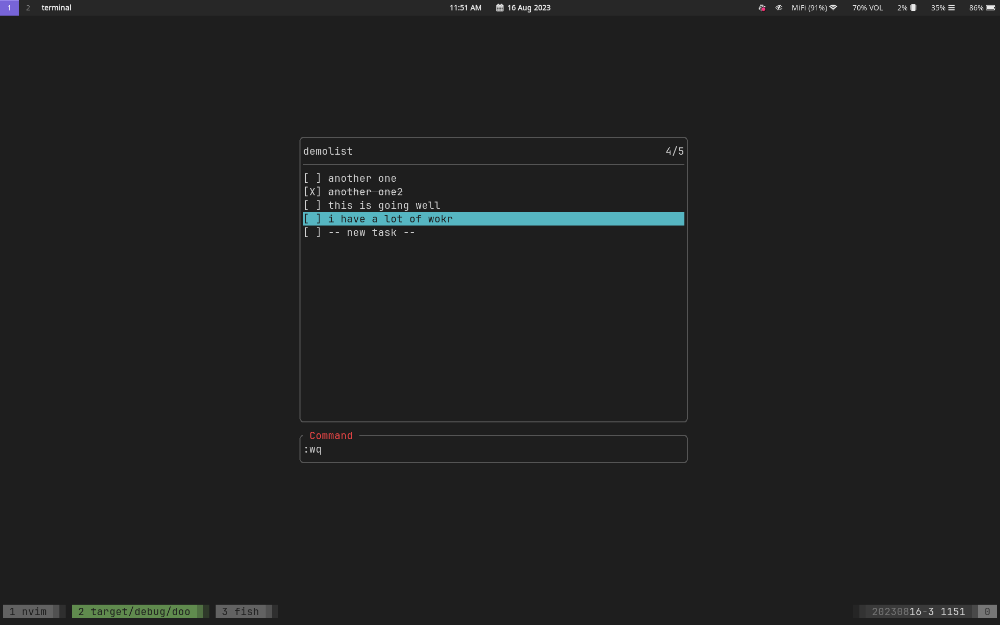

# Doo

Doo provides simple, fast task management in the terminal. It uses Vim keybinds for navigation, task editing, and writing/saving. Built in Rust.



## Usage

Doo is built to match the core Vim keybinds. 

In select mode, you can:
- Use `k` and `j` to navigate up and down a list.
- Use `a` to add a task (this will automatically put you in insert mode for said task)
- Use `i` to enter insert mode for a task

Insert mode accepts text that will be used to change the task name.

You can use `:` to enter command mode, and `esc` to exit.
In command mode, you can use the following commands:
- `help` (open a help menu with relevant commands)
- `q` (quit)
- `w | saveas <optional filename>` (save file)
- `wq <optional filename>` (save and quit)
- `e | load <filename>` (load a relevant file)
- `rename <new filename>` (rename a todo list title)
- `recent` (open a menu of recent files to load)

## Configuration

Doo automically generates a config file at _doo.yml_ for defining the layout of Doo.

```yml
layout:
  vertical: full | top | bottom | center
  horizontal: full | right | left | center
```
